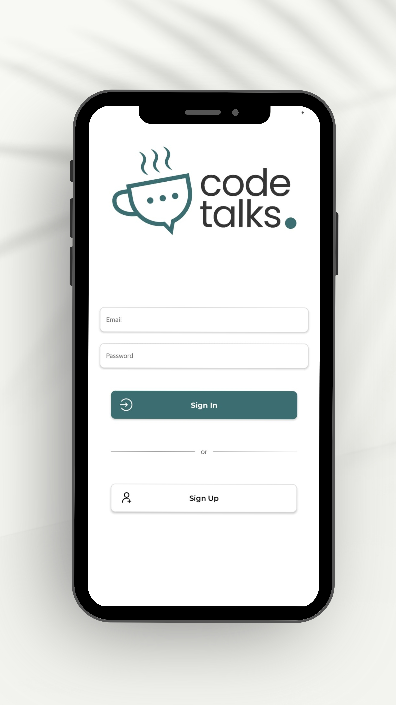
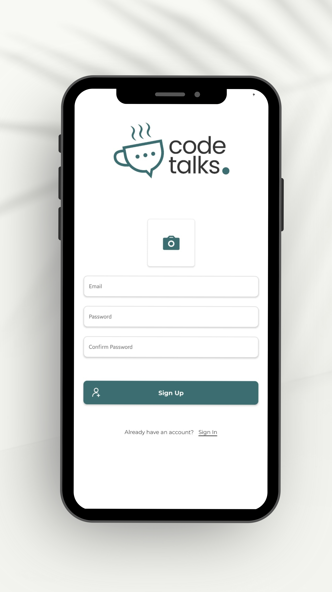
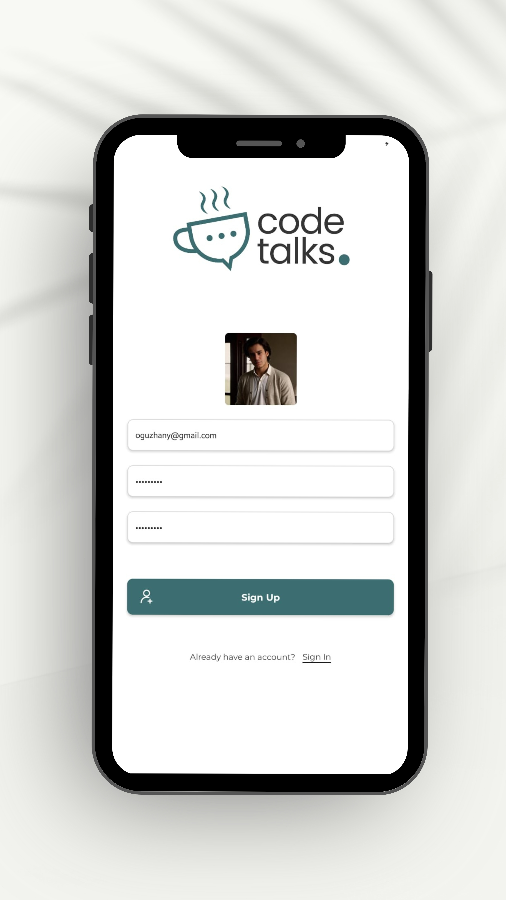
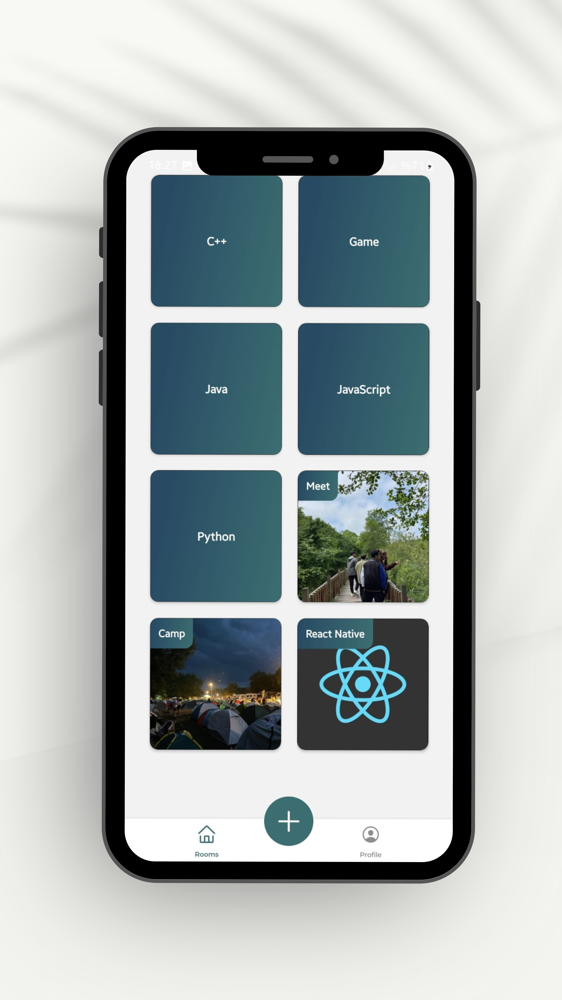
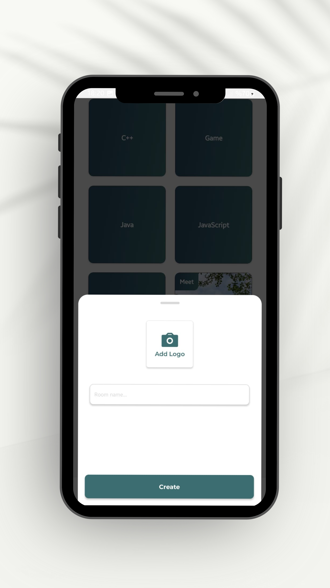
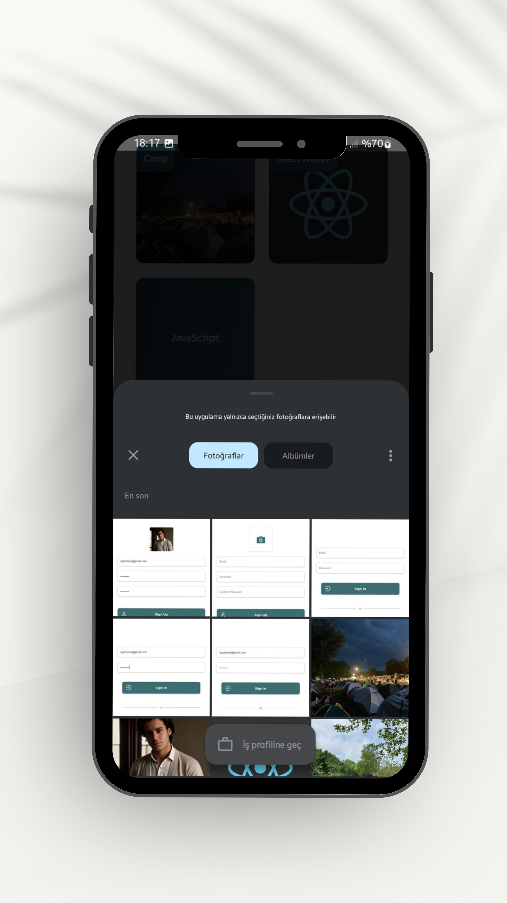
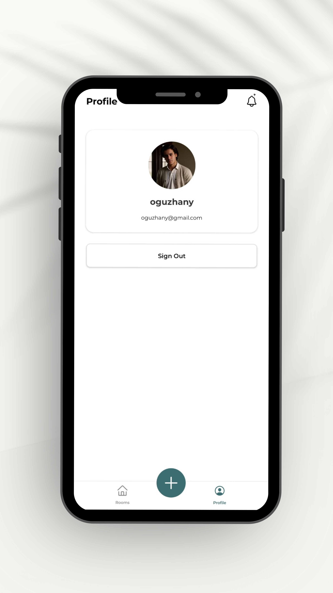
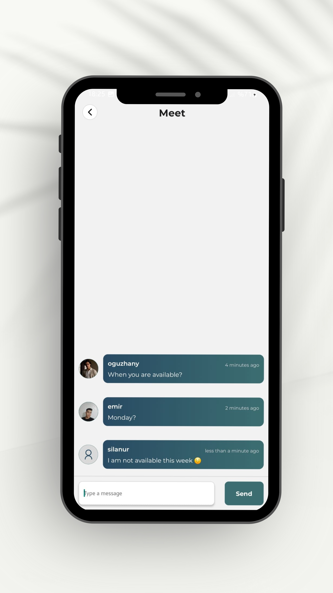
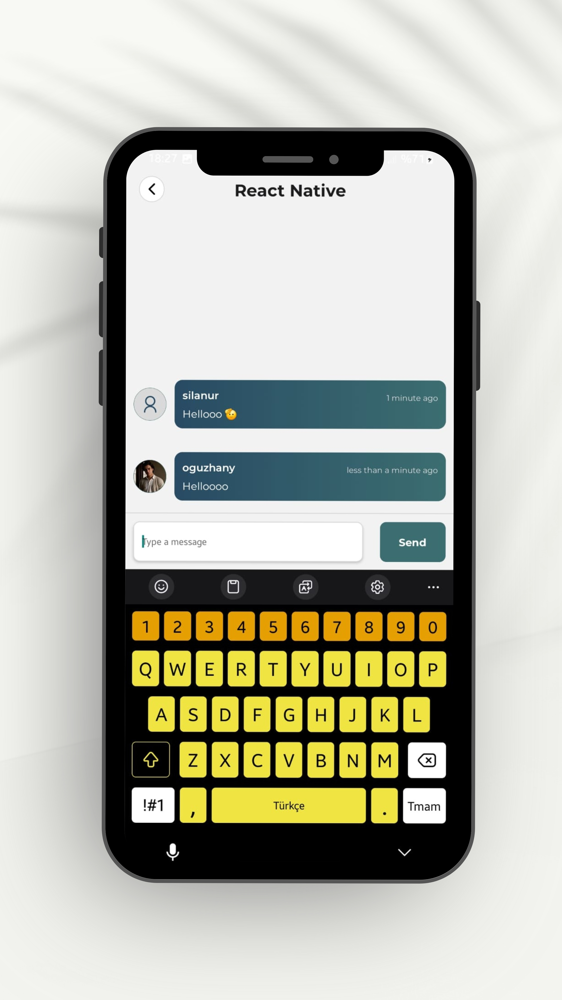

# CodeTalks - Mobile Application

CodeTalks is a mobile application designed to facilitate coding discussions and knowledge sharing within the developer community. The app leverages modern technologies like Firebase for authentication, real-time database, and storage, along with Expo Router for seamless navigation and `date-fns` for date manipulation. This README provides an overview of the features, setup instructions, and additional details for contributors.

## Features

- **Firebase Authentication:**
  - Secure user authentication using Firebase Auth.
  - Supports Google Sign-In for quick user registration and login.

- **Real-time Chat with Firebase Realtime Database:**
  - Users can engage in coding discussions in real-time.
  - Seamless and instant message delivery with Firebase Realtime Database.

- **Cloud Storage:**
  - Users can upload and share code snippets, images, and other files using Firebase Storage.

- **Expo Router for Navigation:**
  - Simplified and organized navigation using Expo’s file-based routing system.

- **Date Handling with `date-fns`:**
  - Efficient and simple date manipulation and formatting using `date-fns`.

## Screenshots

Here are some screenshots showcasing different parts of the application:

| Sign In | Sign Up | Sign Up (Storage) |
|---------|---------|-------------------|
|  |  |  |

| Rooms | Create Room | Create Room |
|-------|-------------|-------------|
|  |  |  |

| Profile | Room In | Room In |
|---------|---------|---------|
|  |  |  |


## Installation

To get started with this project, follow these steps:

1. **Clone the repository:**

   ```bash
   git clone https://github.com/oguzhanyavass/CodeTalks-App.git
